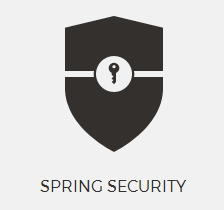

# Spring Security Tutorial 《Spring Security 教程》

 
Spring Security  Tutorial takes you to learn Spring Security  step by step with a large number of samples. There is also a GitBook version of the book: <http://www.gitbook.com/book/waylau/spring-security-tutorial>.
Let's [READ](SUMMARY.md)!

Spring Security Tutorial 是一本关于 Spring Security 学习的开源书。利用业余时间写了本书，图文并茂，用大量实例带你一步一步走进 Spring Security 的世界。如有疏漏欢迎指正，欢迎提问。感谢您的参与！
 
>注:在 Java 界，另外一个值得推荐的安全框架是 Apache Shiro。有关 Apache Shiro 的资料，可以看笔者的另外一本开源书[《Apache Shiro 1.2.x 参考手册》](https://github.com/waylau/apache-shiro-1.2.x-reference)。

### Get Started 如何开始阅读

选择下面入口之一：

* <https://github.com/waylau/spring-security-tutorial/> 的 [SUMMARY.md](SUMMARY.md)（源码）
* <http://waylau.gitbooks.io/spring-security-tutorial/> 点击 Read 按钮（同步更新，国内访问速度一般）
 
### Code 源码

书中所有示例源码，移步至<https://github.com/waylau/spring-security-tutorial>  `samples` 目录下

### Issue 意见、建议

如有勘误、意见或建议欢迎拍砖 <https://github.com/waylau/spring-security-tutorial/issues>

### Contact 联系作者:

* Blog: [waylau.com](http://waylau.com)
* Gmail: [waylau521(at)gmail.com](mailto:waylau521@gmail.com)
* Weibo: [waylau521](http://weibo.com/waylau521)
* Twitter: [waylau521](https://twitter.com/waylau521)
* Github : [waylau](https://github.com/waylau)
