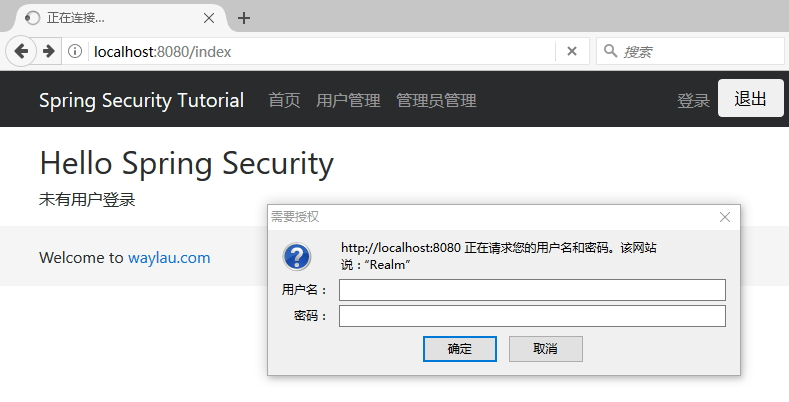
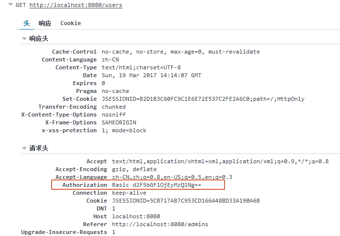

# 基本认证

基本认证在  Web 应用中是非常流行的认证机制。 基本身份验证通常用于无状态客户端，它们在每个请求中传递其凭证。 将其与基于表单的认证结合使用是很常见的，其中通过基于浏览器的用户界面和作为Web服务来使用应用。 但是，基本认证将密码作为纯文本传输，是不安全的，所以它只能在真正通过加密的传输层（如HTTPS）中使用。

 在 `jpa-userdetailsservice`项目的基础上，我们构建了一个`basic-authentication`项目。


## build.gradle
 
 修改 build.gradle 文件，让我们的`basic-authentication`项目成为一个新的项目。

修改内容也比较简单，修改项目名称及版本即可。

```groovy
jar {
	baseName = 'basic-authentication'
	version = '1.0.0'
}
```

## BasicAuthenticationFilter

BasicAuthenticationFilter 负责处理 HTTP 标头中提供的基本身份认证的凭证。 这可以用于认证由 Spring 远程协议（如 Hessian 和 Burlap ）以及正常的浏览器用户代理（如 Firefox 和 Internet Explorer）进行的调用。 管理 HTTP 基本认证的标准由 RFC 1945 第 11 节定义，并且 BasicAuthenticationFilter 符合该 RFC 标准。 基本认证是一种有吸引力的身份验证方法，因为它在用户代理中的部署非常广泛，实现非常简单，它只是`username:password`的 Base64 编码，在 HTTP 头中指定即可。

## 配置

AuthenticationManager 处理每个认证请求。 如果认证失败，将使用配置的 AuthenticationEntryPoint 重试认证过程。 通常，您将过滤器与 BasicAuthenticationEntryPoint 组合使用，它返回一个 401 响应与合适的头重试 HTTP 基本身份验证。 如果认证成功，生成的 Authentication 对象将照常放入 SecurityContextHolder。

如果认证事件成功，或者未尝试认证，因为 HTTP 头不包含支持的认证请求，则过滤器链将正常继续。 过滤器链将被中断的唯一时间点是认证失败并且调用 AuthenticationEntryPoint。

在配置类中，我们将 From 表单认证改为  Basic 认证:

```
......
.httpBasic()   // 使用 Basic 认证
	.and()
.sessionManagement().sessionCreationPolicy(SessionCreationPolicy.STATELESS)// 无状态
	.and()
......
```

## 运行

当我们试图访问受限的资源时，浏览器会弹出输入框，要求我们输入账号密码：



输入之后，就可以在访问相关页面了。我们可以在响应头里面，看到账号密码经过 Base64 编码之后的认证信息：


 
用户的状态信息都是保存在客户端（本例为浏览器），所以，即使后台服务器重启了，只要用户账号还在有效期内，就无需再次登录，即可再次访问服务。


## 如何注销账号

`HttpSecurity.logout()`  是清除  HttpSession 里面存储的用户信息。既然，我们是无状态（无会话），那么自然就无需调用 logout()。

如果是客户端是在浏览器，则直接关闭浏览器即可注销账号。