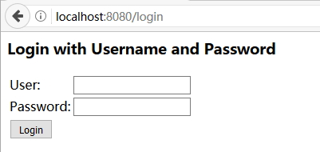
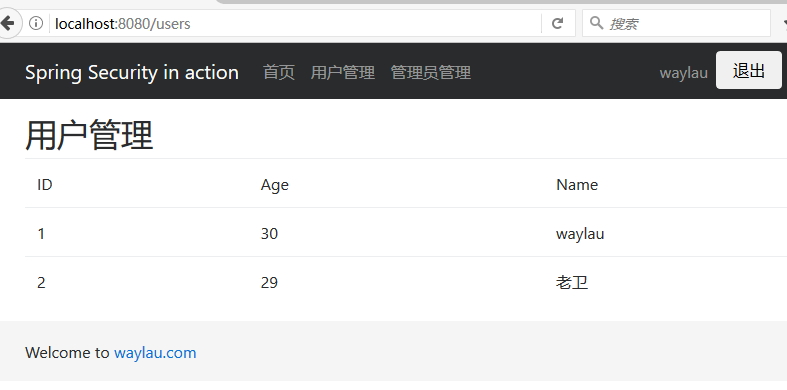
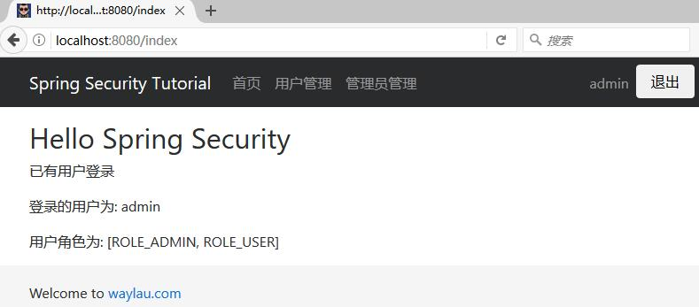
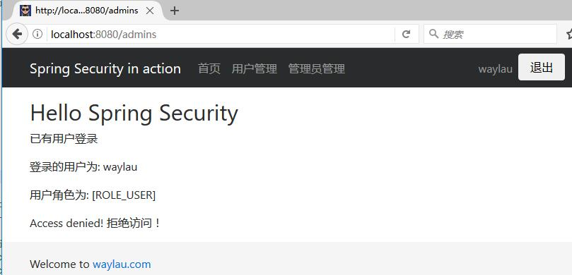

# Hello World
 
依照管理，我们从一个 Hello World 项目入手。

我们新家了一个名为`hello-world`的 Gradle 项目。

基于Form 表单的登录认证。

## 环境

* Gradle 3.4.1
* Spring Boot 1.5.2.RELEASE 
* Thymeleaf 3.0.3.RELEASE
* Thymeleaf Layout Dialect 2.2.0

## Gradle Wrapper

修改 Gradle Wrapper 的配置  `gradle-wrapper.properties`，使用最新的Gradle：
```
distributionBase=GRADLE_USER_HOME
distributionPath=wrapper/dists
zipStoreBase=GRADLE_USER_HOME
zipStorePath=wrapper/dists
distributionUrl=https\://services.gradle.org/distributions/gradle-3.4.1-bin.zip
```


## build.gradle

### 1. 自定义依赖的版本

我们可以自定义 Spring Boot 的版本，比如，我们使用了目前最新的 1.5.2.RELEASE 版本。

```
// buildscript 代码块中脚本优先执行
buildscript {
......
ext {
	springBootVersion = '1.5.2.RELEASE'
}

// 自定义  Thymeleaf 和 Thymeleaf Layout Dialect 的版本
ext['thymeleaf.version'] = '3.0.3.RELEASE'
ext['thymeleaf-layout-dialect.version'] = '2.2.0'
......	
}
```

### 2. 修改项目的名称

修改 build.gradle 文件，让我们的`hello-world`项目成为一个新的项目。

修改内容也比较简单，修改项目名称及版本即可。

```groovy
jar {
	baseName = 'hello-world'
	version = '1.0.0'
}
```


### 3. 修改项目的仓库地址

为了加快构建速度，我们自定义了一个国内的仓库镜像地址：

```
repositories {
	maven {
        url 'http://maven.aliyun.com/nexus/content/groups/public/'
    }
}
```

### 4. 指定依赖

```
// 依赖关系
dependencies {
 
	// 该依赖对于编译发行是必须的
	compile('org.springframework.boot:spring-boot-starter-web')
 
	// 添加 Thymeleaf 的依赖
	compile('org.springframework.boot:spring-boot-starter-thymeleaf')

	// 添加  Spring Security 依赖
	compile('org.springframework.boot:spring-boot-starter-security')

	// 添加   Thymeleaf Spring Security 依赖，与 Thymeleaf 版本一致都是 3.x
	compile('org.thymeleaf.extras:thymeleaf-extras-springsecurity4:3.0.2.RELEASE')
	
	// 该依赖对于编译测试是必须的，默认包含编译产品依赖和编译时依
	testCompile('org.springframework.boot:spring-boot-starter-test')
}
```

## 配置类

```
@EnableWebSecurity
public class SecurityConfig extends WebSecurityConfigurerAdapter {
	......
	/**
	 * 自定义配置
	 */
	@Override
	protected void configure(HttpSecurity http) throws Exception {
		http
			.authorizeRequests()
				.antMatchers("/css/**", "/js/**", "/fonts/**", "/index").permitAll()  // 虽都可以访问
				.antMatchers("/users/**").hasRole("USER")   // 需要相应的角色才能访问
				.antMatchers("/admins/**").hasRole("ADMIN")   // 需要相应的角色才能访问
				.and()
			.formLogin()   //基于 Form 表单登录验证
				.loginPage("/login").failureUrl("/login-error");  // 自定义登录界面
	}
	......
}
```

这段代码内容很少，但事实上已经做了很多的默认安全验证，包括：

* 访问应用中的每个URL都需要进行验证
* 生成一个登陆表单
* 允许用户使用用户名和密码来登陆
* 允许用户注销
* [CSRF](https://en.wikipedia.org/wiki/Cross-site_request_forgery)攻击拦截
* [Session Fixation](https://en.wikipedia.org/wiki/Session_fixation) 攻击
* 安全 Header 集成
	* 启用 [HTTP Strict Transport Security](https://en.wikipedia.org/wiki/HTTP_Strict_Transport_Security)
	* [X-Content-Type-Options](https://msdn.microsoft.com/en-us/library/ie/gg622941(v=vs.85).aspx) 集成
	* Cache Control（ 缓存控制 ）
	* [X-XSS-Protection](https://msdn.microsoft.com/en-us/library/dd565647(v=vs.85).aspx) 集成
	* 集成 X-Frame-Options 来防止 [Clickjacking](https://en.wikipedia.org/wiki/Clickjacking)
* 集成了以下 Servlet API :
	* [HttpServletRequest#getRemoteUser()](https://docs.oracle.com/javaee/6/api/javax/servlet/http/HttpServletRequest.html#getRemoteUser())
	* [HttpServletRequest.html#getUserPrincipal()](https://docs.oracle.com/javaee/6/api/javax/servlet/http/HttpServletRequest.html#getUserPrincipal())
	* [HttpServletRequest.html#isUserInRole(java.lang.String)](https://docs.oracle.com/javaee/6/api/javax/servlet/http/HttpServletRequest.html#isUserInRole(java.lang.String))
	* [HttpServletRequest.html#login(java.lang.String, java.lang.String)](https://docs.oracle.com/javaee/6/api/javax/servlet/http/HttpServletRequest.html#login(java.lang.String,%20java.lang.String))
	* [HttpServletRequest.html#logout()](https://docs.oracle.com/javaee/6/api/javax/servlet/http/HttpServletRequest.html#logout())

	
* 所有匹配 `/users/**`的需要“USER”角色授权
* 所有匹配 `/admins/**`的需要“ADMIN”角色授权
* 基于 Form 表单登录验证的方式。登录界面指定为`/login`，登录失败等会重定向到`/login-error`页面。如果不指定登录界面，则会Spring Security 会提供一个默认的登录页面：




```
/**
 * 用户信息服务
 */
@Bean
public UserDetailsService userDetailsService() {
	InMemoryUserDetailsManager manager = new InMemoryUserDetailsManager(); // 在内存中存放用户信息
	manager.createUser(User.withUsername("waylau").password("123456").roles("USER").build());
	manager.createUser(User.withUsername("admin").password("123456").roles("USER","ADMIN").build());
	return manager;
}

/**
 * 认证信息管理
 * @param auth
 * @throws Exception
 */
@Autowired
public void configureGlobal(AuthenticationManagerBuilder auth) throws Exception {
	auth.userDetailsService(userDetailsService());
}
```

* 用户的认证信息是使用 InMemoryUserDetailsManager 来存储在内存中；
* 我们默认生成了两个用户，一个是“waylau” 是拥有“USER”角色权限；另一个是“admin” 是拥有“USER”以及“ADMIN”角色权限

## 运行

运行程序，访问<http://localhost:8080> 页面。
当我们试图访问以下页面时，提示需要用户登录：

* “用户管理”：对应 “/users” URL；
* “管理员管理”：对应 “/admins” URL

登录页面：


使用具有“USER”角色授权的“waylau”用户登录，可以访问“用户管理”页面：




“waylau”用户登录可以访问“管理员管理”页面时，提示拒绝访问：


此时，我们换用 “admin”账号登录即可访问该页面。返回首页，我们能看到该用户的权限信息：



## 自定义 403 页面

默认的提示拒绝访问页面太丑，我需要自定义一个页面。我们在返回的页面里面提示“拒绝访问！”。

同时，我要在配置类里面，配置重定向的内容：

```
......
.formLogin()   //基于 Form 表单登录验证
	.loginPage("/login").failureUrl("/login-error") // 自定义登录界面
	.and()
.exceptionHandling().accessDeniedPage("/403"); // 处理异常，拒绝访问就重定向到 403 页面
......
```

最终效果：

