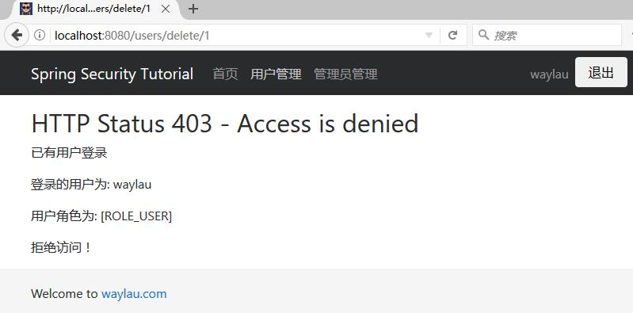
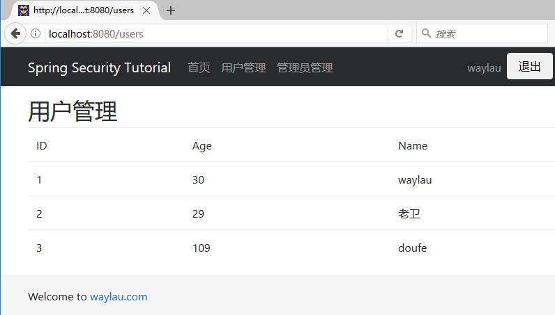
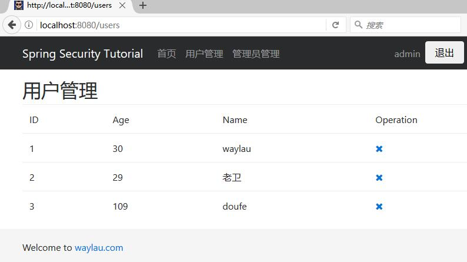

# 方法级别的安全
 
我们在`hello-world-test`的基础上，我们新建了一个名为`method-security`的  Gradle 项目。

本项目用于演示方法级别的安全设置。


## build.gradle
 
 修改 build.gradle 文件，让我们的`method-security`项目成为一个新的项目。

修改内容也比较简单，修改项目名称及版本即可。

```groovy
jar {
	baseName = 'method-security'
	version = '1.0.0'
}
```
 
## 编写服务类

创建`com.waylau.spring.boot.security.service`包，用于放置服务类。创建了 UserService 接口。接口比较简单，主要是用于查询和删除：

```java
public interface UserService {

	void removeUser(Long id);
	
	List<User> listUsers();
}
```

UserServiceImpl 是 UserService 接口的实现，在内存里面模拟了 User 的存储库。

```java
@Service
public class UserServiceImpl implements UserService {

	private static final Map<Long,User> userRepository = new ConcurrentHashMap<>();
	
	public UserServiceImpl(){
		userRepository.put(1L, new User(1L, "waylau", 30));
		userRepository.put(2L, new User(2L,"老卫", 29));
		userRepository.put(3L, new User(3L,"doufe", 109));
	}
 
	@Override
	public void removeUser(Long id) {
		userRepository.remove(id);
	}
 
	@Override
	public List<User> listUsers() {
		List<User> users = null;
		users = new ArrayList<User>(userRepository.values()); 
		return users;
	}

}
```

## 控制器

在 UserController 中，增加了删除用户的方法：

```java
@PreAuthorize("hasAuthority('ROLE_ADMIN')")  // 指定角色权限才能操作方法
@GetMapping(value = "delete/{id}")
public ModelAndView delete(@PathVariable("id") Long id, Model model) {
	userService.removeUser(id);
	model.addAttribute("userList", userService.listUsers());
	model.addAttribute("title", "删除用户");
	return new ModelAndView("users/list", "userModel", model);
}
```

其中，我们使用了 `@PreAuthorize`注解。

## 配置类

在配置类上，我们加上了一个注解 `@EnableGlobalMethodSecurity` ：

```
@EnableWebSecurity
@EnableGlobalMethodSecurity(prePostEnabled = true)  // 启用方法安全设置
public class SecurityConfig extends WebSecurityConfigurerAdapter {
	......
}
```

注意：`@EnableGlobalMethodSecurity` 可以配置多个参数:

* prePostEnabled :决定 Spring Security 的前注解是否可用`@PreAuthorize`、`@PostAuthorize`等
* secureEnabled : 决定是否Spring Security的保障注解 `@Secured`是否可用
* jsr250Enabled ：决定 JSR-250 注解`@RolesAllowed`等是否可用.
 
配置方式分别如下：

```java
@EnableGlobalMethodSecurity(securedEnabled = true)
public class MethodSecurityConfig {
// ...
}

@EnableGlobalMethodSecurity(jsr250Enabled = true)
public class MethodSecurityConfig {
// ...
}


@EnableGlobalMethodSecurity(prePostEnabled = true)
public class MethodSecurityConfig {
// ...
}
```


在同一个应用程序中，可以启用多个类型的注解，但是只应该设置一个注解对于行为类的接口或者类。如果将2个注解同事应用于某一特定方法，则只有其中一个将被应用。


### `@Secured`

此注释是用来定义业务方法的安全配置属性的列表。您可以在需要安全角色/权限等的方法上指定 `@Secured`，并且只有那些角色/权限的用户才可以调用该方法。如果有人不具备要求的角色/权限但试图调用此方法，将会抛出 AccessDenied 异常。

`@Secured` 源于 Spring之前版本.它有一个局限就是不支持 Spring EL 表达式。可以看看下面的例子：


如果你想指定AND（和）这个条件，我的意思说deleteUser 方法只能被同时拥有ADMIN & DBA 。但是仅仅通过使用`@Secured`注解是无法实现的。

但是你可以使用Spring的新的注解`@PreAuthorize`/`@PostAuthorize`（支持Spring EL），使得实现上面的功能成为可能，而且无限制。

### `@PreAuthorize`/`@PostAuthorize`

Spring的 `@PreAuthorize`/`@PostAuthorize` 注解更适合方法级的安全,也支持Spring EL 表达式语言，提供了基于表达式的访问控制。

* @PreAuthorize 注解:适合进入方法前的权限验证， @PreAuthorize 可以将登录用户的角色/权限参数传到方法中。
* @PostAuthorize 注解:使用并不多，在方法执行后再进行权限验证。 

## 运行

运行项目，我们查看下最终的效果：
 


我们用“USER”角色权限可以查看用户列表，但如果想删除用户，则提示“访问拒绝”。

## 根据权限来显示或者隐藏操作

实际上，如果用户不具备某个操作的权限，那么那个操作按钮就不应该显示出来。我们可以使用`sec:authorize`属性能达到这个目的。

修改list.html 中的表格：

```
......
<table class="table table-hover">
    <thead>
    <tr>
        <td>ID</td>
        <td>Age</td>
        <td>Name</td>
        <td sec:authorize="hasRole('ADMIN')">Operation</td>
    </tr>
    </thead>
    <tbody>
    <tr th:if="${userModel.userList.size()} eq 0">
        <td colspan="3">没有用户信息！！</td>
    </tr>
    <tr th:each="user : ${userModel.userList}">
        <td th:text="${user.id}">1</td>
        <td th:text="${user.age}">11</td>
        <td th:text="${user.name}">waylau</a></td>
        <td sec:authorize="hasRole('ADMIN')">
        	<div >
				<a th:href="@{'/users/delete/' + ${user.id}}">
					<i class="fa fa-times" aria-hidden="true"></i>
				</a>
   			</div>
		</td>
    </tr>
    </tbody>
</table>
......
```

我们使用了` <td sec:authorize="hasRole('ADMIN')">`这样，只要是具备“ADMIN”权限的用户就能看到删除操作列，否则就看不到那一列的删除操作。效果如下：

不具备“ADMIN”权限的用户：



具备“ADMIN”权限的用户：


