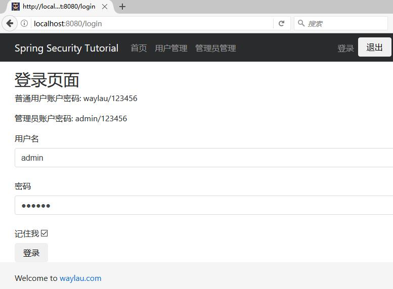
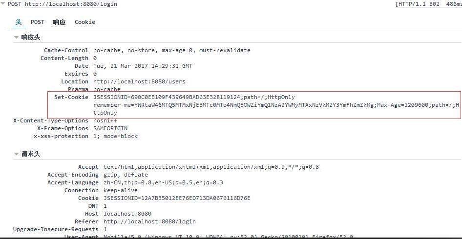

# Remember-Me（记住我）认证：基于散列的令牌方法

我们在 `password-encoder`上，基于 Form 表单的方式，来实现基于散列的令牌方法的  Remember-Me 认证，我们新建一个 `remember-me-hash`项目。

## build.gradle
 
 修改 build.gradle 文件，让我们的`remember-me-hash`项目成为一个新的项目。

修改内容也比较简单，修改项目名称及版本即可。

```groovy
jar {
	baseName = 'remember-me-hash'
	version = '1.0.0'
}
```


## Remember-Me（记住我）认证
 
Remember-Me或持久的登录身份验证是指网站能够记住身份之间的会话。这通常是通过发送 cookie 到浏览器，cookie 在未来会话中被检测到，并导致自动登录发生。Spring Security 为这些操作提供了必要的钩子，并且有两个具体的实现。

* 使用散列来保存基于 cookie 的令牌的安全性
* 使用数据库或其他持久存储机制来存储生成的令牌


需要注意的是，这些实现都需要`UserDetailsService`。如果您使用的是一种身份验证提供程序不使用`UserDetailsService`（例如，LDAP 程序），这样该机制就不会正常工作，除非在你的应用程序上下文中有 `UserDetailsService` bean。

## 简单的基于散列的令牌方法

这种方法使用散列实现一个有用的 Remember-Me 的策略。其本质是，在认证成功后，cookie 被发送到浏览器进行交互。 cookie 的组成如下：

```
base64(username + ":" + expirationTime + ":" +
md5Hex(username + ":" + expirationTime + ":" password + ":" + key))

username:         UserDetailsService 中的身份标识
password:         UserDetails 中的密码
expirationTime:   随机数到期的日期和时间，以毫秒为单位
key:              用于防止随机数标记被修改的私钥
```

因此，Remember-Me 令牌仅适用于指定的期间，并且提供的用户名、密码和密钥不会更改。值得注意的是，这有一个潜在的安全问题，即任何用户代理只要捕获了  Remember-Me 令牌就能一直使用直到令牌过期。这是与摘要验证存在的相同的问题。如果一个认证主体意识到令牌已被截获，他们可以通过密码，来将之前的 Remember-Me 令牌作废。如果需要更重要的安全性，您应该使用下一节中描述的方法。另外 Remember-Me 的服务根本不应该使用。
 
## TokenBasedRememberMeServices

TokenBasedRememberMeServices 产生 RememberMeAuthenticationToken，并由 RememberMeAuthenticationProvider 处理。这种身份验证提供者 与 TokenBasedRememberMeServices 之间共享 key 。此外，TokenBasedRememberMeServices 需要从它可以检索签名比较目的的用户名和密码 UserDetailsService ，生成的 RememberMeAuthenticationToken 包含正确的 GrantedAuthority。当用户使用无效的 Cookie 发起请求时，注销命令将由应用程序提供。 TokenBasedRememberMeServices 还实现了 Spring Security 的 LogoutHandler 接口，可以用 LogoutFilter  自动清除 Cookie。


## 配置

实现 Remember-Me 较为简单，只需要添加`.rememberMe().key(KEY)`即可，其中 KEY 是自定义的密钥值。完整配置如下：

```
private static final String KEY = "waylau.com";
......
@Override
protected void configure(HttpSecurity http) throws Exception {
	http.authorizeRequests().antMatchers("/css/**", "/js/**", "/fonts/**", "/index").permitAll() // 都可以访问
			.antMatchers("/h2-console/**").permitAll() // 都可以访问
			.antMatchers("/users/**").hasRole("USER") // 需要相应的角色才能访问
			.antMatchers("/admins/**").hasRole("ADMIN") // 需要相应的角色才能访问
			.and()
			.formLogin()   //基于 Form 表单登录验证
			.loginPage("/login").failureUrl("/login-error") // 自定义登录界面
			.and().rememberMe().key(KEY) // 启用 remember me
			.and().exceptionHandling().accessDeniedPage("/403");  // 处理异常，拒绝访问就重定向到 403 页面
	http.csrf().ignoringAntMatchers("/h2-console/**"); // 禁用 H2 控制台的 CSRF 防护
	http.headers().frameOptions().sameOrigin(); // 允许来自同一来源的H2 控制台的请求
}
......
```

## 设置 Remember-Me 选择项

在登录界面，我们设置一个设置 Remember-Me 选择项。

```
......
<div>
    <label for="remember-me">记住我</label>
    <input type="checkbox" name="remember-me" id="remember-me">
</div>
......
```

选择Remember-Me 选择项进行登录，则即使服务器重启，下次登录系统仍无需重新登录系统。

以下为登录界面：



登录后，可以看到 Cookie 里面看到 Remember-Me 的令牌值：

