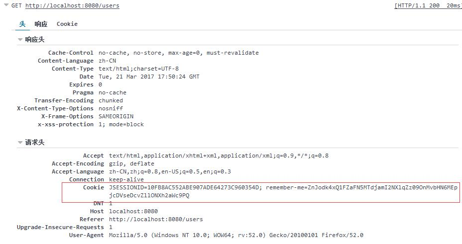
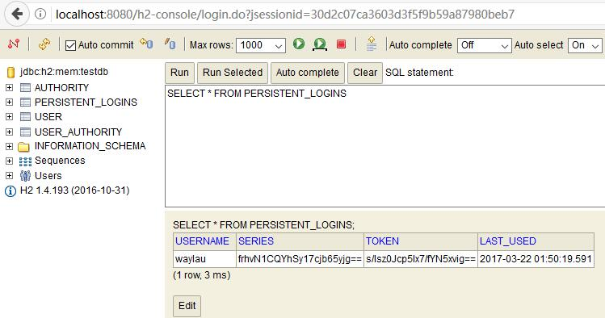

# Remember-Me（记住我）认证：基于持久化的令牌方法
 

## 基于持久化的令牌方法

这种方法使用数据库来存储令牌信息。这种方法是基于 <http://jaspan.com/improved_persistent_login_cookie_best_practice> 文章所做出的小修改。使用这种方法可以提供一个数据源引用：
 
```sql
create table persistent_logins (username varchar(64) not null,
								series varchar(64) primary key,
								token varchar(64) not null,
								last_used timestamp not null)
```


## PersistentTokenBasedRememberMeServices

这个类可以使用相同的方式 TokenBasedRememberMeServices，但它还需要配置一个 PersistentTokenRepository 来存储令牌。有两个标准实现。

* InMemoryTokenRepositoryImpl ：仅用于测试。
* JdbcTokenRepositoryImpl ：存储令牌到数据库中。

本例，我们将使用 JdbcTokenRepositoryImpl 将令牌存储到数据库中：

```
@Autowired
private DataSource dataSource;

@Bean  
public JdbcTokenRepositoryImpl tokenRepository() {
	JdbcTokenRepositoryImpl tokenRepository = new JdbcTokenRepositoryImpl();
	tokenRepository.setCreateTableOnStartup(true);   // 启动时自动建表，但重启数据会丢失
	tokenRepository.setDataSource(dataSource);
	return tokenRepository;
};
```

其中 setCreateTableOnStartup 方法是可选的，如果设置为 　true ，则会自动创建 persistent_logins 表结构，但缺点是，原有的数据将会丢失。


## 配置

在 `.rememberMe().key(KEY).tokenRepository(tokenRepository())` 指明 PersistentTokenRepository 的实现方式。

完整配置如下:

```
@Override
protected void configure(HttpSecurity http) throws Exception {
	http.authorizeRequests().antMatchers("/css/**", "/js/**", "/fonts/**", "/index").permitAll() // 都可以访问
			.antMatchers("/h2-console/**").permitAll() // 都可以访问
			.antMatchers("/users/**").hasRole("USER") // 需要相应的角色才能访问
			.antMatchers("/admins/**").hasRole("ADMIN") // 需要相应的角色才能访问
			.and()
			.formLogin()   //基于 Form 表单登录验证
			.loginPage("/login").failureUrl("/login-error") // 自定义登录界面
			.and().rememberMe().key(KEY).tokenRepository(tokenRepository()) // 启用 remember me
			.and().exceptionHandling().accessDeniedPage("/403");  // 处理异常，拒绝访问就重定向到 403 页面
	http.csrf().ignoringAntMatchers("/h2-console/**"); // 禁用 H2 控制台的 CSRF 防护
	http.headers().frameOptions().sameOrigin(); // 允许来自同一来源的H2 控制台的请求
}
```


## 运行


登录后，可以看到 Cookie 里面看到 Remember-Me 的令牌值：




我们也可以在数据中看到这个登录信息：



当用户注销后，该数据信息自动会删除。